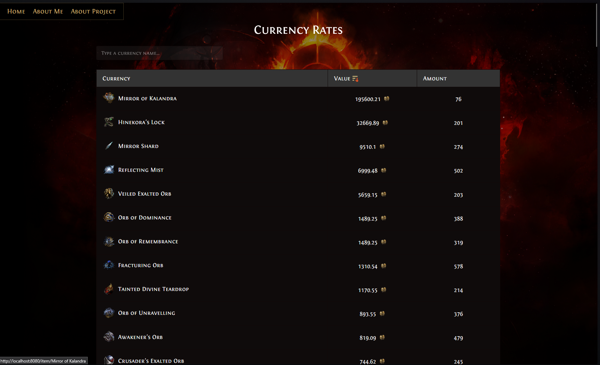
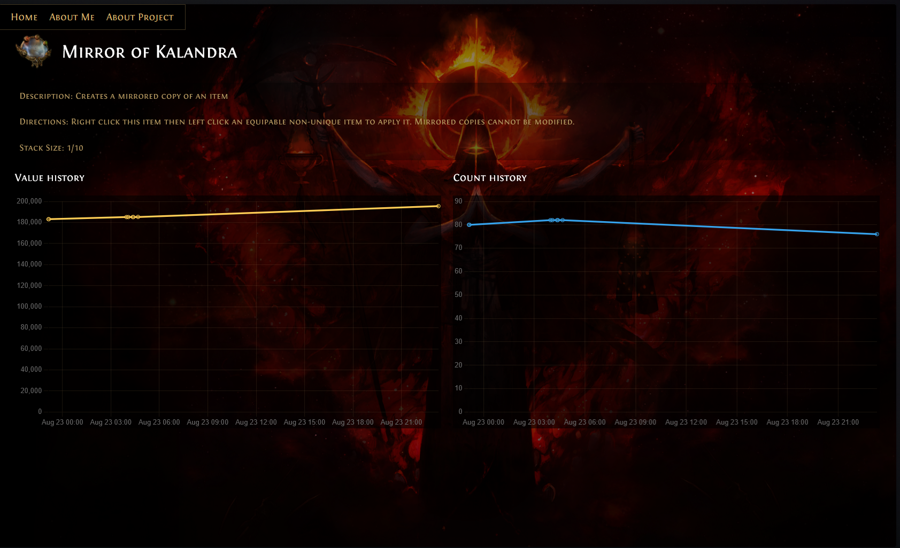
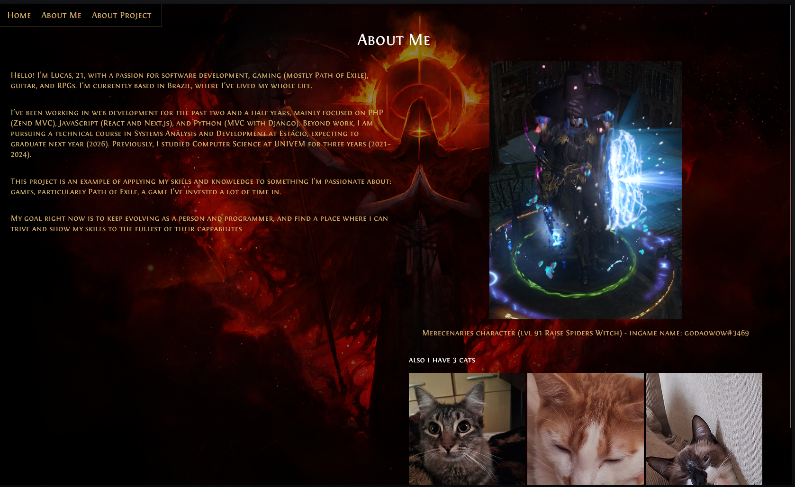
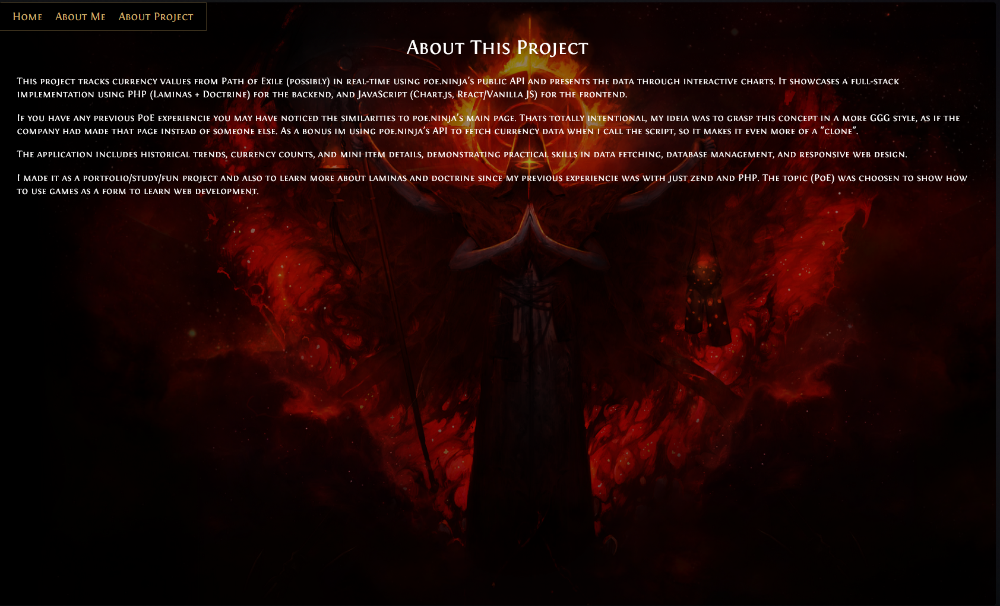

## PoE Currency Tracker

A Laminas MVC project to track Path of Exile currency values and listings. Works with both Docker and non-Docker setups.

---

### Introduction

#### This application uses the Laminas MVC skeleton and Doctrine ORM. It allows you to:

- Import item data from items.json.
- Fetch the latest currency rates from a public API.
- Display charts with value and listing count history per currency.
- Usage of css and scss to create responsive and production ready designs
- Designed to demonstrate full-stack skills and real-time data handling.
- Currently only uses a fixed league (mercenaries), but that could be improved.
- Overwall the project is simple in its functionalities, the focus was to make then really reliable and production ready in the most possible ways, as i preffer quality over quantity.
---

### About the Project

#### This project showcases:

- Backend: PHP 8.3, Laminas MVC, Doctrine ORM, SQLite, Composer scripts
- Frontend: HTML5, CSS3 and SCSS, JavaScript ES6+, Chart.js
- Deployment: Docker, docker-compose, PHP-FPM, cron jobs, Nginx/Apache
- Dev Tools: Git, PHPUnit, laminas-test, Psalm, PHPCS
- Achievements: End-to-end data pipeline, automated updates, responsive charts, maintainable code structure

---

### Pages in the project


#### Home 
This is the main page when you enter the site, displaying all the curencies currently listed (onyl lists ones that have a chaos value > 0)




#### Item 
This page shows the deatils about an especific item, it has two graphs showing the historical price and count fetches of the item in the league



#### About secions
also two sections talking about me and the project






 

## Instalation after cloning the repo

### Docker Vs Manual
Please consider using docker to build and run the project, that's the most secure way to ensure the project runs in your machine. In case you don't have or don't want to use docker, the composer setup is also avaliable, but keep in mind of the prerequisites.

---

### Docker Setup

#### Dockerfile

- PHP 8.3-FPM with SQLite and cron
- Composer dependencies installed in a separate build stage
- Entry point script handles DB updates, imports, currency fetch, cron, and PHP-FPM start

#### docker-compose.yml
```yml
services:
  app:
    build: .
    container_name: poe-tracker-app
    volumes:
      - ./public:/var/www/html/public
      - ./src:/var/www/html/src
      - ./bin:/var/www/html/bin
    networks:
      - poe-network

  web:
    image: nginx:stable-alpine
    container_name: poe-tracker-nginx
    ports:
      - "8080:80"
    volumes:
      - ./public:/var/www/html/public
      - ./docker/nginx/default.conf:/etc/nginx/conf.d/default.conf
    depends_on:
      - app
    networks:
      - poe-network

networks:
  poe-network:
    driver: bridge

```
#### Build & Run
100~200 seconds
```bash
docker-compose up -d --build
```
Access via http://localhost:8080

---

#### Cron Jobs

To periodically fetch currency data:
```
*/15 * * * * root /var/www/html/bin/fetch-currency.sh >> /var/www/html/fetch-currency.log 2>&1
# !
```
Interval recommendation: Every 15 minutes for public APIs to avoid rate limiting.

since im using poe.ninja's public api to fetch data, this step is necessary to ensure not having problems with access (and rate limiting)


---
### Prerequisites (Non-Docker Setup)

- PHP 8.3 or compatible
- Composer
- SQLite 
- Web server (Apache, Nginx, or PHP built-in server (easiest))


### Installation using Composer

#### Install project dependencies
This may take a while 
```bash
composer install --no-dev --optimize-autoloader
```
---

### Database Setup

Currently im using SQLITE to run the program, simply create a poe_tracker.sqlite file inside the /data/ folder.

#### Copy all .dist files
Create copies of the .dist files without the .dist 
- config/development.config.php.dist 
- config/autoload/local.php.dist
- config/autoload/development.local.php.dist

#### Update database schema using Doctrine
```bash
vendor/bin/doctrine-module orm:schema-tool:update --force
```
#### Import initial items
```bash
php bin/fetch-currency-item.php
```
#### Fetch initial currency rates
```bash
php bin/fetch-currency.php "Mercenaries"
```
---

### Running the Project

#### Using PHP Built-in Server (Development Only)
```bash
php -S 0.0.0.0:8080 -t public
```
Visit http://localhost:8080

#### Apache Setup

Create a virtual host pointing to public/:
```conf
<VirtualHost *:80>
    ServerName poe-tracker.local
    DocumentRoot /path/to/project/public
    <Directory /path/to/project/public>
        DirectoryIndex index.php
        AllowOverride All
        Require all granted
    </Directory>
</VirtualHost>
```
Restart Apache.

#### Nginx + PHP-FPM Setup

Example config (/etc/nginx/sites-enabled/poe-tracker.conf):
```conf
server {
    listen 80;
    server_name poe-tracker.local;
    root /path/to/project/public;

    location / {
        index index.php;
        try_files $uri $uri/ @php;
    }

    location @php {
        fastcgi_pass 127.0.0.1:9000;
        fastcgi_param SCRIPT_FILENAME /path/to/project/public/index.php;
        include fastcgi_params;
    }

    location ~ /\.ht {
        deny all;
    }
}
```
---

#### License

MIT


#### if you reached this far, thanks for taking your time to look at the project! i appreciate that :) 
